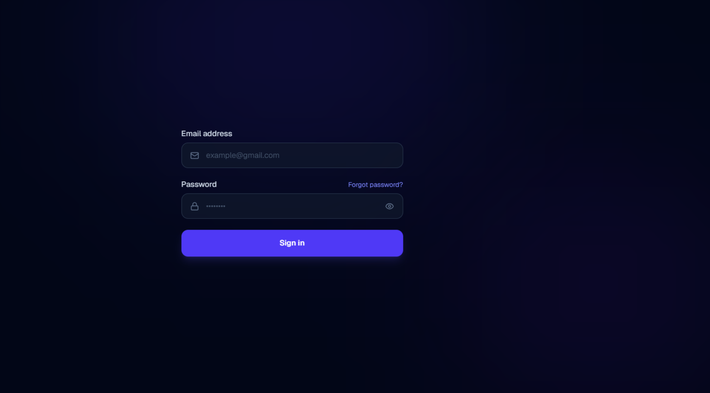
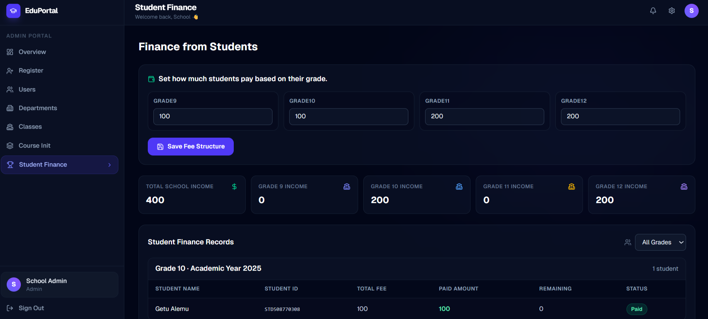
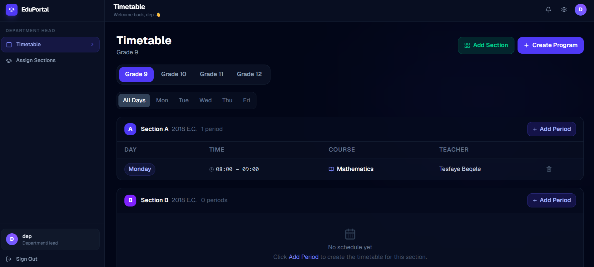
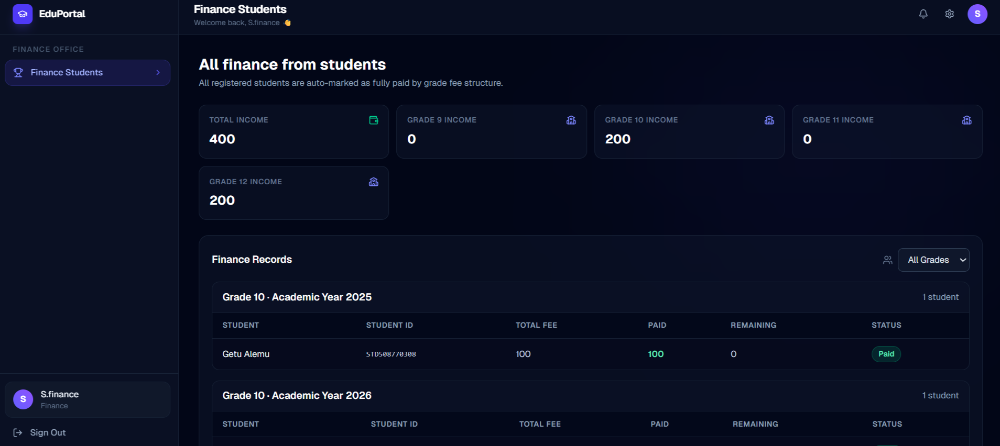
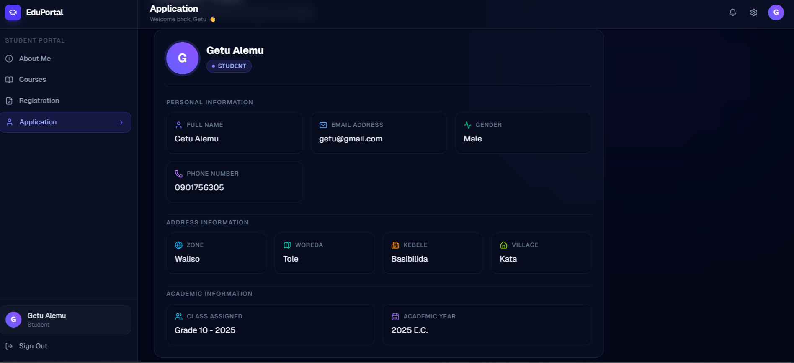

#  School Management System (Full-Stack)

A full-stack web application for managing school operations across multiple roles: **Admin, Registrar, Department Head, Teacher, Student, and Finance**.

## Live Demo

🔗 [https://school-ms-f4de.onrender.com/](https://school-ms-f4de.onrender.com/)

##  Screenshots

Use the following screenshots to showcase the main areas of the system:

### Login Page

### Admin Dashboard

### Department Dashboard

### Finance Dashboard

### Student Dashboard

---

##  Demo Credentials

Use the following accounts to explore different roles:

* **Admin**
  Email: [adminschool@gmail.com](mailto:adminschool@gmail.com)
  Password: 123@admin

* **Finance**
  Email: [finance@gmail.com](mailto:finance@gmail.com)
  Password: 123@abdi

* **Registrar**
  Email: [register@gmail.com](mailto:register@gmail.com)
  Password: 123@abdi

* **Department Head**
  Email: [dep@gmail.com](mailto:dep@gmail.com)
  Password: 123@abdi

* **Teacher**
  Email: [amin@gmail.com](mailto:amin@gmail.com)
  Password: 123@abdi

* **Student**
  Email: [getu@gmail.com](mailto:student1@gmail.com)
  Password: 123@abdi

##  Key Features

###  Admin

* Manage system users (create, update, delete)
* Configure grade-based payment structures
* Monitor system-wide dashboard and analytics

###  Registrar

* Register students with detailed location data (Zone, Woreda, Kebele, Village)
* Manage and update student records

###  Department Head

* Manage department courses and staff
* Oversee academic structure within the department

###  Teacher

* Access assigned courses
* Manage student grading and academic data

###  Student

* View profile and academic information
* Check payment and academic status

###  Finance

* Track and manage student payments
* Mark students as paid/unpaid
* Configure payments based on grade

###  General System Features

* Role-based authentication and secure access control
* Course, class, and department management
* Attendance tracking and student ranking
* Pre-seeded courses for Grades 9–12 (including streams)

##  Tech Stack

### Frontend (`client/`)

* Next.js 16 (App Router)
* React 19
* TypeScript
* Tailwind CSS 4
* React Query
* Zustand
* Axios

### Backend (`server/`)

* Node.js + Express 5
* MongoDB + Mongoose
* JWT authentication
* CORS, cookie-parser, dotenv

##  Project Structure

* `client/` — frontend app (UI, pages, hooks, services)
* `server/` — backend API (routes, controllers, services, models)

---

##  Prerequisites

* Node.js 18+ (recommended: latest LTS)
* npm 9+
* MongoDB instance (local or cloud)

##  Environment Variables

A root `.env` template is included for convenience.

### Required values

| Variable              | Purpose                   | Example                                              |
| --------------------- | ------------------------- | ---------------------------------------------------- |
| `PORT`                | Backend server port       | `5000`                                               |
| `MONGO_URI`           | MongoDB connection string | `mongodb://localhost:27017/school_management_system` |
| `JWT_SECRET`          | JWT signing secret        | `replace-with-strong-secret`                         |
| `JWT_EXPIRES_IN`      | JWT expiry duration       | `90d`                                                |
| `NODE_ENV`            | Runtime mode              | `development`                                        |
| `NEXT_PUBLIC_API_URL` | Frontend API base URL     | `http://localhost:5000/api`                          |

> Note: Backend code uses `dotenv` from `server/`. Keep your server env values available there in real deployments.

##  Getting Started (Local Development)

### 1) Install dependencies

From the project root:

* install backend dependencies: `npm run install:server`
* install frontend dependencies: `npm --prefix client install`

### 2) Start backend

From root:

* `npm run dev`

Backend default health check:

* `GET http://localhost:5000/`

### 3) Start frontend

In a second terminal:

* `npm --prefix client run dev`

Open:

* `http://localhost:3000`

---

##  Available Scripts

### Root (`package.json`)

* `npm run start` → start backend (`server/src/server.js`)
* `npm run dev` → run backend in dev mode with nodemon
* `npm run install:server` → install backend dependencies

### Frontend (`client/package.json`)

* `npm --prefix client run dev` → start Next.js dev server
* `npm --prefix client run build` → build frontend
* `npm --prefix client run start` → start production frontend
* `npm --prefix client run lint` → run ESLint

### Backend (`server/package.json`)

* `npm --prefix server run dev` → start API with nodemon
* `npm --prefix server run start` → start API with Node

##  API Route Groups

The backend exposes grouped routes under `/api`:

* `/api/auth`
* `/api/student`
* `/api/teacher` and `/api/teachers`
* `/api/registrar`
* `/api/department`
* `/api/admin`
* `/api/finance`

##  Deployment Notes

* Backend deployed on Render
* Ensure environment variables are set in production
* Update CORS configuration in `server/src/server.js`

